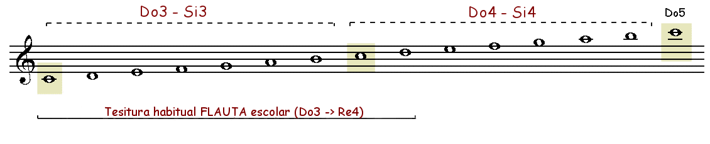

# 3. "Las notas alteradas Sib, Fa# y Sol# (Do3 a Re4)"
### Contenidos
- **Lección 8**.- Fragmentos de escalas dentro del ámbito Do3 - Re4
- **Lección 9**.- Notas alteradas: Sib
- **Lección 10**.- Notas alteradas: Fa#
- **Lección 11**.- Notas alteradas: Sol#

### Objetivos

1. Conocer las tres notas alteradas que se emplearán en los temas y melodías escolares: Sib, Fa# y Sol#.

2. Adquirir técnica con fragmentos de escalas por grados conjuntos entre Do3 y Re4 en las tonalidades de DoM, FaM, SolM y Lam.

### Conocimientos previos

1. Saber leer partituras rítmicas y melódicas sencillas (nivel elemental) que incluyan:

- Ritmos básicos en compás de 2, 3 y 4 tiempos (redondas, blancas, negras, corcheas, semicorcheas, figuras con puntillo y ligaduras de prolongación).
- Melodías sencillas con un ámbito de Do3 a Re4, aunque es recomendable realizar lecturas hasta el La4 (ver subíndices sonoros).

2. Saber seguir el pulso o pulsación (tempo) una vez establecido. Esto es particularmente importante cuando los ejercicios y actividades deban ser realizados con un acompañamiento armónico-rítmico digital (Mp3).

3. Conocer los aspectos básicos del lenguaje musical: figuras y silencios, pulso y compás, repeticiones con y sin casillas, articulaciones básicas, signos de intensidad, puntillos y ligaduras de prolongación, compases simples, alteraciones, etc.

4. Conocer los subíndices sonoros como medio para localizar la altura exacta de un determinado sonido o nota musical:

SUBÍNDICES SONOROS

