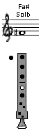
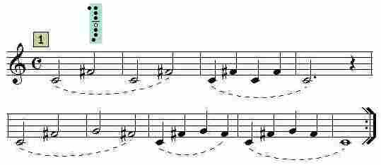
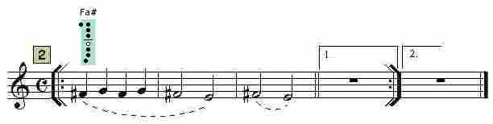
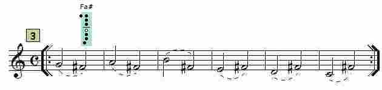
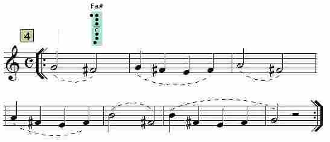
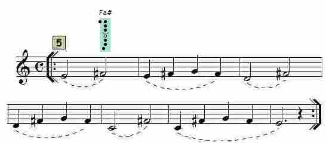
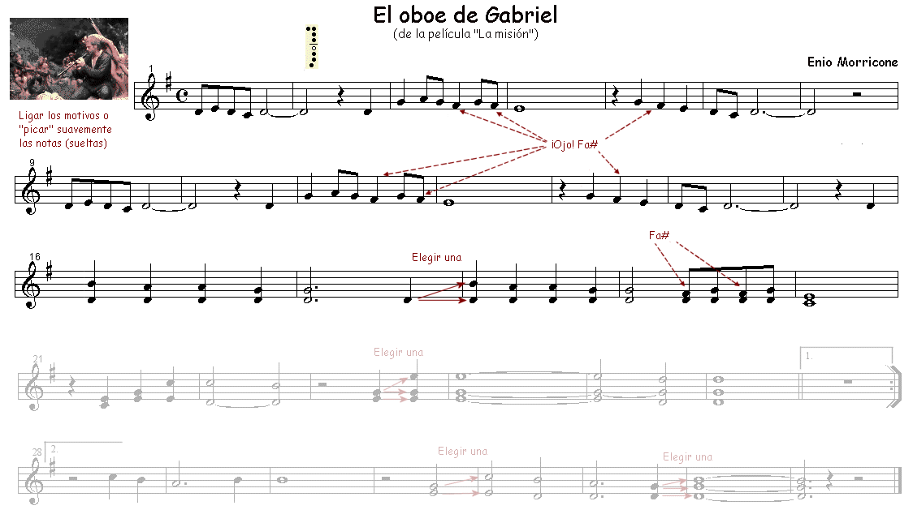
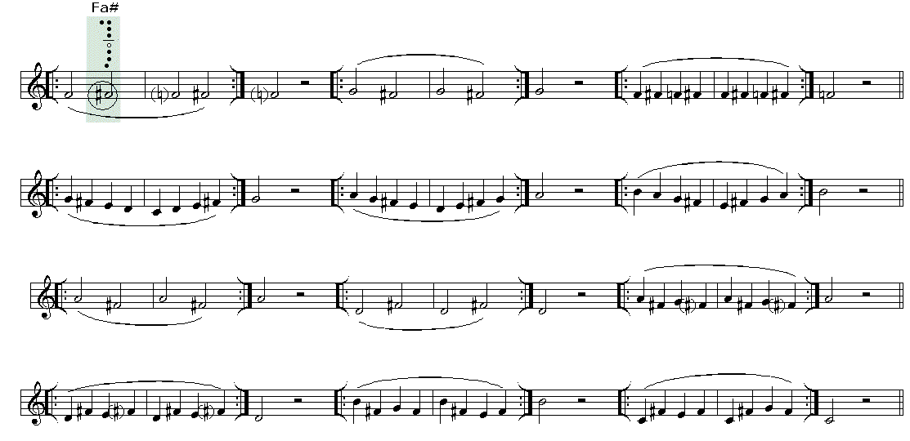

# Lección 10.- "Notas alteradas: Fa#"

**EJERCICIOS**

**Forma de realización**

- Estudiar primero sin audio.

- Una vez aprendido clicar sobre el audio y tocar con él adecuándose al 'tempo' establecido.

- Recordar las indicaciones que sobre el estudio instrumental se dieron en la "Introducción" del Módulo I.

<iframe width="100%" height="166" scrolling="no" frameborder="no" src="https://w.soundcloud.com/player/?url=https%3A//api.soundcloud.com/tracks/344090236&amp;color=%23ff5500&amp;auto_play=false&amp;hide_related=false&amp;show_comments=true&amp;show_user=true&amp;show_reposts=false"></iframe>

CLICAR Y TOCAR

<iframe width="100%" height="166" scrolling="no" frameborder="no" src="https://w.soundcloud.com/player/?url=https%3A//api.soundcloud.com/tracks/344090238&amp;color=%23ff5500&amp;auto_play=false&amp;hide_related=false&amp;show_comments=true&amp;show_user=true&amp;show_reposts=false"></iframe>

CLICAR Y TOCAR

<iframe width="100%" height="166" scrolling="no" frameborder="no" src="https://w.soundcloud.com/player/?url=https%3A//api.soundcloud.com/tracks/344090239&amp;color=%23ff5500&amp;auto_play=false&amp;hide_related=false&amp;show_comments=true&amp;show_user=true&amp;show_reposts=false"></iframe>

CLICAR Y TOCAR

<iframe width="100%" height="166" scrolling="no" frameborder="no" src="https://w.soundcloud.com/player/?url=https%3A//api.soundcloud.com/tracks/344090242&amp;color=%23ff5500&amp;auto_play=false&amp;hide_related=false&amp;show_comments=true&amp;show_user=true&amp;show_reposts=false"></iframe>

CLICAR Y TOCAR

<iframe width="100%" height="166" scrolling="no" frameborder="no" src="https://w.soundcloud.com/player/?url=https%3A//api.soundcloud.com/tracks/344090245&amp;color=%23ff5500&amp;auto_play=false&amp;hide_related=false&amp;show_comments=true&amp;show_user=true&amp;show_reposts=false"></iframe>

CLICAR Y TOCAR

Armonización y edición audios: R.Páez Perza
## Realiza

Arreglo y edición audio y partitura: R. Páez Perza

<iframe width="100%" height="166" scrolling="no" frameborder="no" src="https://w.soundcloud.com/player/?url=https%3A//api.soundcloud.com/tracks/344090301&amp;color=%23ff5500&amp;auto_play=false&amp;hide_related=false&amp;show_comments=true&amp;show_user=true&amp;show_reposts=false"></iframe>

CLICAR Y TOCAR

## ACTIVIDADES DE AMPLIACIÓN (opcionales)

**Actividad de ampliación 1**

**Actividad de ampliación 2**

**Actividad de ampliación 3**

Realiza los ejercicios de la Lección 8 que contengan la nota Fa y cámbiala por Fa# (los Si deben ser naturales).
