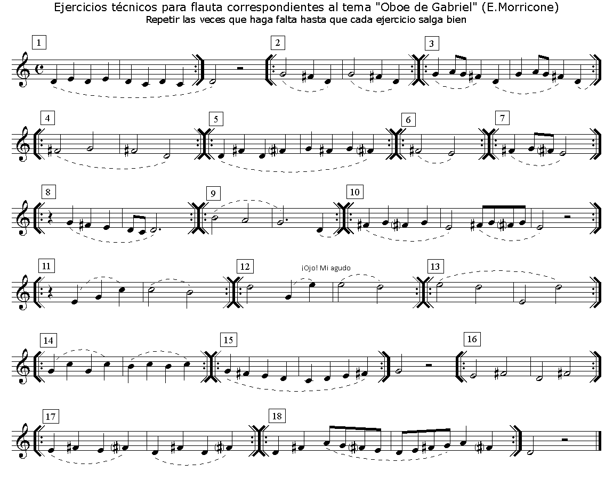

# Lección 10.- "Notas alteradas: Fa#"

******EJERCICIOS**

**Forma de realización**

- Estudiar primero sin audio.

- Una vez aprendido clicar sobre el audio y tocar con él adecuándose al 'tempo' establecido.

- Recordar las indicaciones que sobre el estudio instrumental se dieron en la "Introducción" del Módulo I.

[EjerFla_Alteracion_Fa_sost_1.mp3](EjerFla_Alteracion_Fa_sost_1.mp3)</audio>

CLICAR Y TOCAR

[EjerFla_Alteracion_Fa_sost_2.mp3](EjerFla_Alteracion_Fa_sost_2.mp3)</audio>

CLICAR Y TOCAR

[EjerFla_Alteracion_Fa_sost_3.mp3](EjerFla_Alteracion_Fa_sost_3.mp3)</audio>

CLICAR Y TOCAR

[EjerFla_Alteracion_Fa_sost_4.mp3](EjerFla_Alteracion_Fa_sost_4.mp3)</audio>

CLICAR Y TOCAR

[EjerFla_Alteracion_Fa_sost_5.mp3](EjerFla_Alteracion_Fa_sost_5.mp3)</audio>

CLICAR Y TOCAR

## Realiza

Arreglo y edición audio: R. Páez Perza

[OboeGabriel_Fa#_.mp3](OboeGabriel_Fa_num__.mp3)</audio>

CLICAR Y TOCAR

NOTA.- En **[www.adarmus.com](http://www.adarmus.com/zMiscelanea.htm) **encontrarás algunos de estos audios de acompañamiento completos.

## ACTIVIDADES DE AMPLIACIÓN (opcionales)

**Actividad de ampliación 1**

**Actividad de ampliación 2**

**Ø**

**Actividad de ampliación 3**

Realiza los ejercicios de la Lección 8 que contengan la nota Fa y cámbiala por Fa# (los Si deben ser naturales).
