# Lección 11.- "Notas alteradas: Sol#"

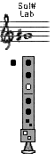

**EJERCICIOS**

**Forma de realización**

- Estudiar primero sin audio.

- Una vez aprendido clicar sobre el audio y tocar con él adecuándose al 'tempo' establecido.

- Recordar las indicaciones que sobre el estudio instrumental se dieron en la "Introducción" del Módulo I.

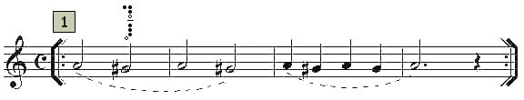
<iframe width="100%" height="166" scrolling="no" frameborder="no" src="https://w.soundcloud.com/player/?url=https%3A//api.soundcloud.com/tracks/344090250&amp;color=%23ff5500&amp;auto_play=false&amp;hide_related=false&amp;show_comments=true&amp;show_user=true&amp;show_reposts=false"></iframe>

Acompañamiento del ejercicio 1 (clicar y tocar)
 
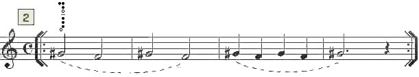

<iframe width="100%" height="166" scrolling="no" frameborder="no" src="https://w.soundcloud.com/player/?url=https%3A//api.soundcloud.com/tracks/344090251&amp;color=%23ff5500&amp;auto_play=false&amp;hide_related=false&amp;show_comments=true&amp;show_user=true&amp;show_reposts=false"></iframe>

Acompañamiento del ejercicio 2 (clicar y tocar)
 
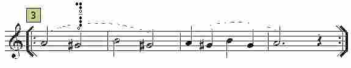

<iframe width="100%" height="166" scrolling="no" frameborder="no" src="https://w.soundcloud.com/player/?url=https%3A//api.soundcloud.com/tracks/344090252&amp;color=%23ff5500&amp;auto_play=false&amp;hide_related=false&amp;show_comments=true&amp;show_user=true&amp;show_reposts=false"></iframe>

Acompañamiento del ejercicio 3 (clicar y tocar)
 
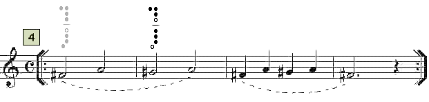

<iframe width="100%" height="166" scrolling="no" frameborder="no" src="https://w.soundcloud.com/player/?url=https%3A//api.soundcloud.com/tracks/344090253&amp;color=%23ff5500&amp;auto_play=false&amp;hide_related=false&amp;show_comments=true&amp;show_user=true&amp;show_reposts=false"></iframe>

Acompañamiento del ejercicio 4 (clicar y tocar)
 
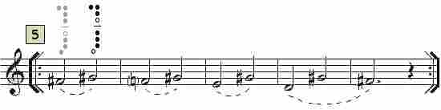

<iframe width="100%" height="166" scrolling="no" frameborder="no" src="https://w.soundcloud.com/player/?url=https%3A//api.soundcloud.com/tracks/344090254&amp;color=%23ff5500&amp;auto_play=false&amp;hide_related=false&amp;show_comments=true&amp;show_user=true&amp;show_reposts=false"></iframe>

Acompañamiento del ejercicio 5 (clicar y tocar)
 
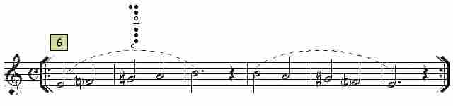

<iframe width="100%" height="166" scrolling="no" frameborder="no" src="https://w.soundcloud.com/player/?url=https%3A//api.soundcloud.com/tracks/344090256&amp;color=%23ff5500&amp;auto_play=false&amp;hide_related=false&amp;show_comments=true&amp;show_user=true&amp;show_reposts=false"></iframe>

Acompañamiento del ejercicio 6 (clicar y tocar)
 
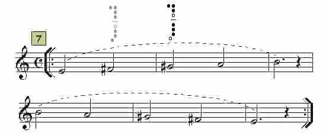

<iframe width="100%" height="166" scrolling="no" frameborder="no" src="https://w.soundcloud.com/player/?url=https%3A//api.soundcloud.com/tracks/344090257&amp;color=%23ff5500&amp;auto_play=false&amp;hide_related=false&amp;show_comments=true&amp;show_user=true&amp;show_reposts=false"></iframe>

Acompañamiento del ejercicio 7 (clicar y tocar)
 

## Realiza / Interpreta

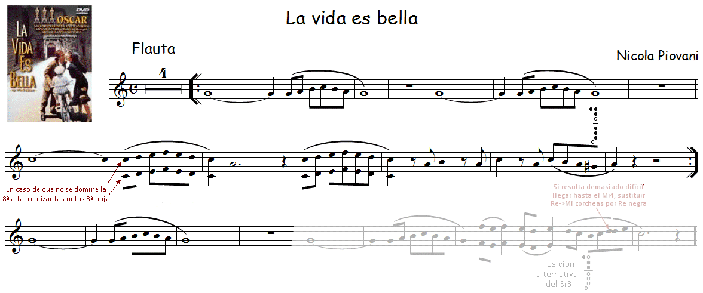

Arreglo y edición audio: R. Páez Perza

<iframe width="100%" height="166" scrolling="no" frameborder="no" src="https://w.soundcloud.com/player/?url=https%3A//api.soundcloud.com/tracks/344090305&amp;color=%23ff5500&amp;auto_play=false&amp;hide_related=false&amp;show_comments=true&amp;show_user=true&amp;show_reposts=false"></iframe>

CLICAR Y TOCAR

## ACTIVIDADES DE AMPLIACIÓN (opcionales)

**Actividad de ampliación 1 **

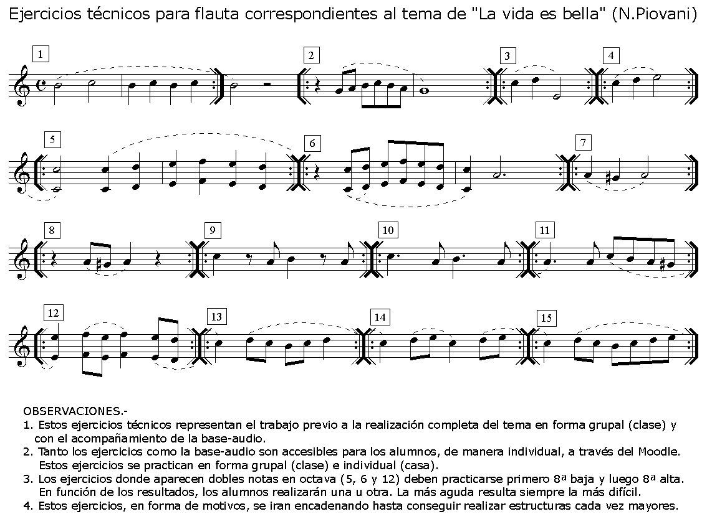

**Actividad de ampliación 2**

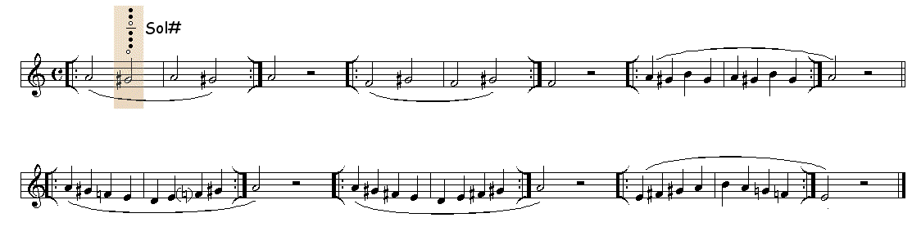

**Actividad de ampliación 3**

 Realiza todos los ejercicios de la Lección 8 que contengan la nota Sol y cámbiala por Sol# (los Fa y los Si deben ser naturales).
