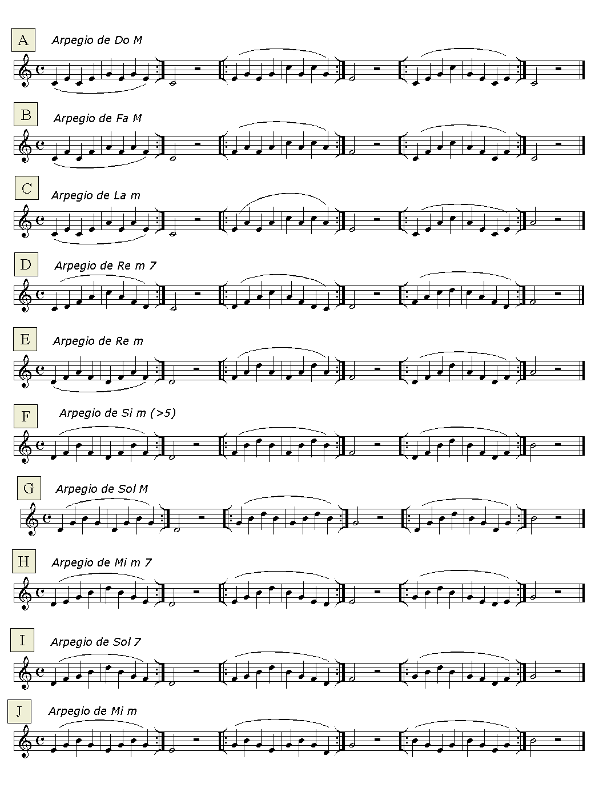

# Lección 12.- "Arpegios en la tonalidad de Do mayor (Do3 - Re4)"

**ARPEGIOS **

Se denomina arpegio al despliegue melódico de un acorde. Los arpegios que se estudiarán a continuación pertenecen todos a la tonalidad de Do mayor y no superan el Re4. Se trata de los diferentes acordes tríadas y cuatríadas que se forman con cada una de las notas de la escala de Do mayor.

## ACTIVIDADES DE AMPLIACIÓN (opcionales)

**Actividad de ampliación 1**

Realiza los ejercicios F, G. H, I, J y cambia los SI por Sib. 

**Actividad de ampliación 2**

Realiza todos los ejercicios que contengan la nota Fa y cámbialas por Fa# (los Si deben ser naturales).

**Actividad de ampliación 3**

 Realiza todos los ejercicios que contengan la nota Sol y cámbialas por Sol# (los Fa y los Si deben ser naturales).
