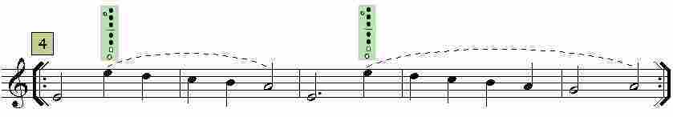

# Lección 13.- "El paso a la octava aguda"

En esta lección estudiaremos cómo llegar hasta el Mi4 de la segunda octava u octava aguda. El Mi4 es la primera nota perteneciente a la 8ª alta o aguda. Para emitirla correctamente hay que abrir parcialmente el orificio del pulgar (un cuarto o un tercio aproximadamente). Con esto es suficiente pues la posición de los restantes dedos es la misma que para el Mi3 de la 8ª inferior.

**EJERCICIOS**

**Forma de realización**

- Estudiar primero sin audio.

- Una vez aprendido clicar sobre el audio y tocar con él adecuándose al 'tempo' establecido.

- Recordar las indicaciones que sobre el estudio instrumental se dieron en la "Introducción" del Módulo I.

Armonización y edición audio: R. Páez Perza

[EjerFla_OctavaAlta1_1.mp3](EjerFla_OctavaAlta1_1.mp3)</audio>

CLICAR Y TOCAR /Ejer. 1)

Armonización y edición audio: R. Páez Perza

[EjerFla_OctavaAlta1_2.mp3](EjerFla_OctavaAlta1_2.mp3)</audio>

CLICAR Y TOCAR (Ejer. 2)

[EjerFla_OctavaAlta1_3.mp3](EjerFla_OctavaAlta1_3.mp3)</audio>

CLICAR Y TOCAR (Ejer. 3)

Armonización y edición audio: R. Páez Perza

[EjerFla_OctavaAlta1_4_.mp3](EjerFla_OctavaAlta1_4_.mp3)</audio>

### CLICAR Y TOCAR (Ejer. 4)

## ACTIVIDADES DE AMPLIACIÓN (opcionales)

**Actividad de ampliación 1**

Lee y realiza-estudia-trabaja los ejercicios siguientes:

**Actividad de ampliación 2**

Vuelve a repasar los temas siguientes y realízalos empleando la voz o parte melódica superior que es la que llega hasta la 8ª aguda (Mi4).

- "Titanic", compás 17 (Módulo III, lección 9, notas alteradas: Sib)
- "El oboe de Gabriel" compás 23 (Módulo III, lección 10, notas alteradas: Fa#)
- "La vida es bella", compases 14, 26 y 27 (Módulo III, lección 11, notas alteradas: Sol#)
