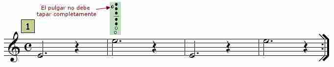
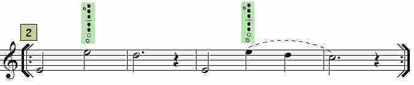
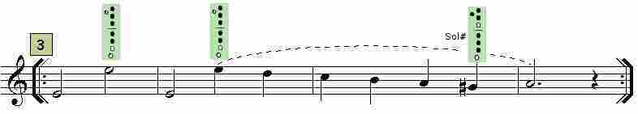
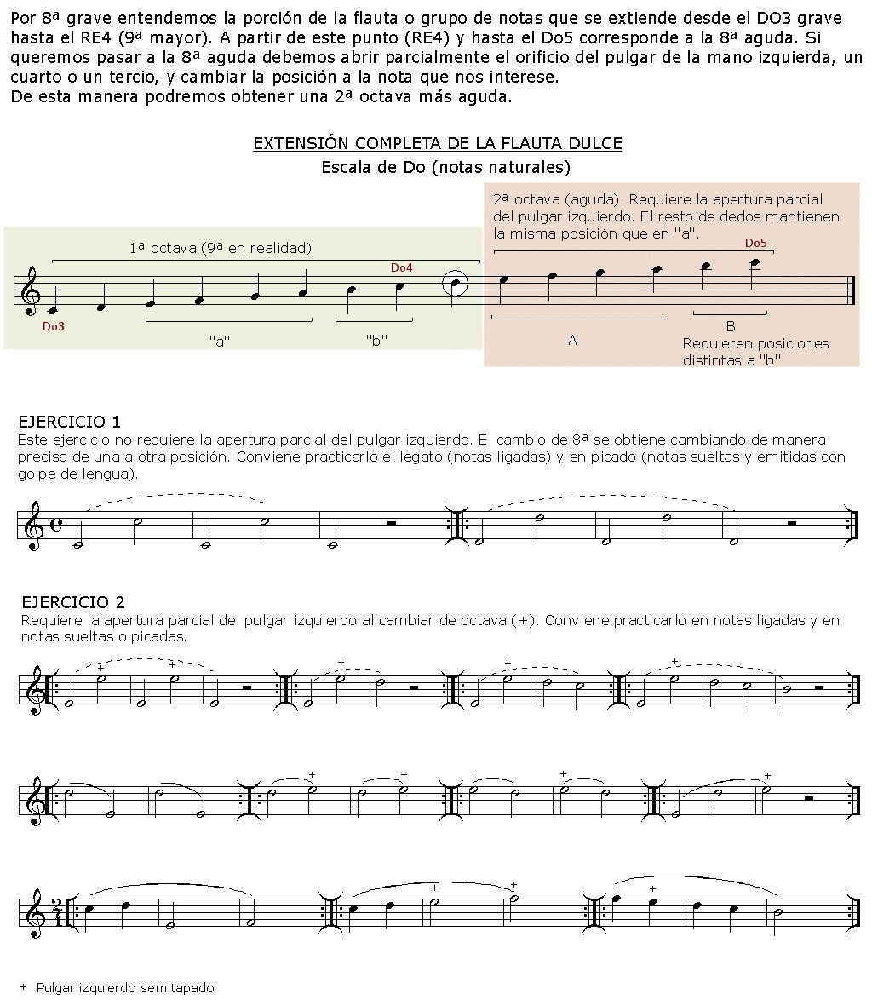

# Lección 13.- "El paso a la octava aguda"

En esta lección estudiaremos cómo llegar hasta el Mi4 de la segunda octava u octava aguda. El Mi4 es la primera nota perteneciente a la 8ª alta o aguda (sin tener encuenta el Re#4/Mib4, nota alterada que no se estudia en este curso). Para emitir correctamente las notas de esta octava hay que abrir parcialmente el orificio del pulgar (un cuarto o un tercio aproximadamente) y enviar el aire con algo más de presión pero con cuidado ya que en esta octava las notas suenan con mucha más intensidad y es fácil desafinar (quedan altas si se sopla demasiado fuerte). La posición de los dedos es la misma que para el Mi3 de la primera octava, por lo tanto, solo tenemos que abrir el orificio del pulgar y enviar algo más de presión para que el Mi3 salte al Mi4 y viceversa.
 

**EJERCICIOS**

**Forma de realización**

- Estudiar primero sin audio.

- Una vez aprendido clicar sobre el audio y tocar con él adecuándose al 'tempo' establecido.

- Recordar las indicaciones que sobre el estudio instrumental se dieron en la "Introducción" del Módulo I.

<iframe width="100%" height="166" scrolling="no" frameborder="no" src="https://w.soundcloud.com/player/?url=https%3A//api.soundcloud.com/tracks/344090260&amp;color=%23ff5500&amp;auto_play=false&amp;hide_related=false&amp;show_comments=true&amp;show_user=true&amp;show_reposts=false"></iframe>

Acompañamiento del ejercicio 1 (clicar y tocar)
 
 

<iframe width="100%" height="166" scrolling="no" frameborder="no" src="https://w.soundcloud.com/player/?url=https%3A//api.soundcloud.com/tracks/344090261&amp;color=%23ff5500&amp;auto_play=false&amp;hide_related=false&amp;show_comments=true&amp;show_user=true&amp;show_reposts=false"></iframe>

Acompañamiento del ejercicio 2 (clicar y tocar)
 
 

<iframe width="100%" height="166" scrolling="no" frameborder="no" src="https://w.soundcloud.com/player/?url=https%3A//api.soundcloud.com/tracks/344090262&amp;color=%23ff5500&amp;auto_play=false&amp;hide_related=false&amp;show_comments=true&amp;show_user=true&amp;show_reposts=false"></iframe>

Acompañamiento del ejercicio 3 (clicar y tocar)
 
 

<iframe width="100%" height="166" scrolling="no" frameborder="no" src="https://w.soundcloud.com/player/?url=https%3A//api.soundcloud.com/tracks/344090263&amp;color=%23ff5500&amp;auto_play=false&amp;hide_related=false&amp;show_comments=true&amp;show_user=true&amp;show_reposts=false"></iframe>

Acompañamiento del ejercicio 4 (clicar y tocar)  Armonización y edición audios: R. Páez Perza

## ACTIVIDADES DE AMPLIACIÓN (opcionales)

**Actividad de ampliación 1**

Lee y realiza-estudia-trabaja los ejercicios siguientes:

**Actividad de ampliación 2**

Vuelve a repasar los temas siguientes y realízalos empleando la voz o parte melódica superior que es la que llega hasta la 8ª aguda (Mi4).

- "Titanic", compás 17 (Módulo III, lección 9, notas alteradas: Sib)
- "El oboe de Gabriel" compás 23 (Módulo III, lección 10, notas alteradas: Fa#)
- "La vida es bella", compases 14, 26 y 27 (Módulo III, lección 11, notas alteradas: Sol#)
