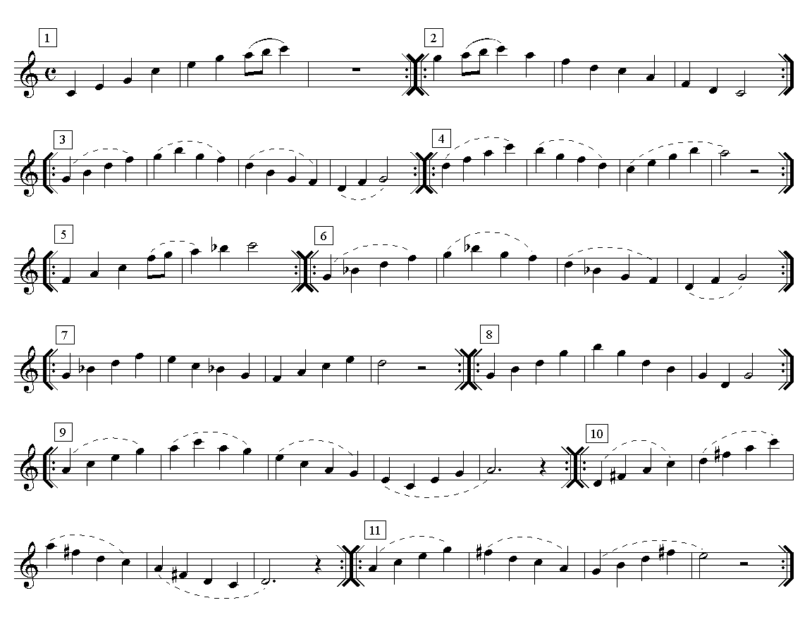

# Lección 14.- "La octava aguda"

En la lección anterior estudiamos como llegar hasta la nota Mi4, primera nota de la octava alta de la flauta escolar. En esta lección aprenderemos el resto de posiciones, incluyendo las notas alteradas, hasta llegar al Do5, última nota de la flauta escolar.

Tocar en el registro agudo o segunda octava dentro del ámbito escolar resulta bastante complicado debido a:

1. Dificultad de emisión directa, es decir, como notas sueltas.
1. Dificultad de afinación, especialmente cuando se realizan actividades grupales al unísono.
1. Registro poco "cálido", incluso estridente si no se domina.
1. La intensidad de la flauta se duplica o triplica

Como ya se mencionó en las primeras lecciones, el registro habitual en el ámbito escolar es el que va del Do3 al Re4 y de manera excepcional del Do3 al Mi4 (con posibilidad de llegar al La4). Llegar a notas más altas resulta excepcional, problemático y no es aconsejable a menos que se domine este registro. 

En cuanto a las características del registro agudo es conveniente saber que:

- El La4 ofrece ciertas dificultades de para mantener su sonido estable. Suele "fallar" y es de difícil emisión directa.
- Las notas de este registro requieren algo más de presión de la columna de aire y tienen mucha mayor intensidad.
- Las posiciones hasta el La4 son las mismas que en el registro grave, abriendo ligeramente el orificio del pulgar izquierdo.
- Las notas Si4 y Do5 no coinciden con las posiciones de la octava inferior. Y lo mismo cabe decir de las notas alteradas.
- En caso de emplear este registro, seleccionar solo a dos o tres alumnos-as que tengan facilidad y dominio de estas notas. 
- Como orientación, indicar que no conviene ir más allá del Mi4 ("Titanic", "La vida es bella", "El oboe de Gabriel", temas del módulo III).

## Ejercicios

## ACTIVIDADES DE AMPLIACIÓN (opcionales)

**Actividad de ampliación 1**

****

Armonización y edición audio: R. Páez Perza

[Frase_1_8ªaguda_Ac+Metro.mp3](Frase_1_8aaguda_AcMetro.mp3)</audio>

CLICAR Y TOCAR

**Actividad de ampliación 2**

****

Armonización y edición audio: R. Páez Perza

[Frase_2_8ªaguda_Acordes.mp3](Frase_2_8aaguda_Acordes.mp3)</audio>

CLICAR Y TOCAR

**Forma de realización** 

- Realizar la parte superior (con audio).
- Realizar la parte inferior (con audio).
- Realizar ambas partes, a dúo (con o sin audio).
