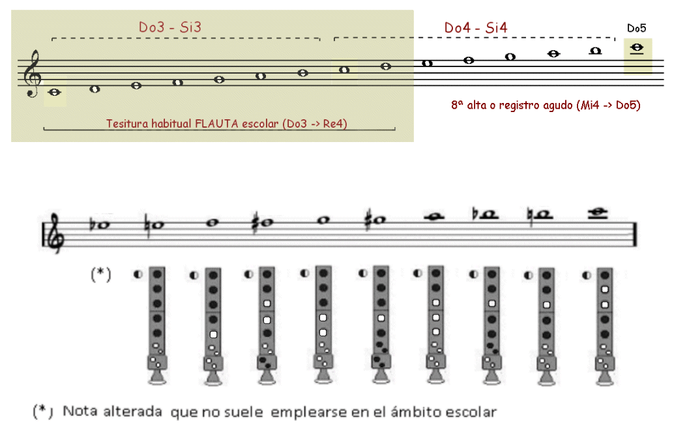

# Lección 14.- "La octava aguda"

En la lección anterior estudiamos como llegar hasta la nota Mi4, primera nota de la octava alta de la flauta escolar. En esta lección aprenderemos el resto de posiciones, incluyendo las notas alteradas, hasta llegar al Do5, última nota de la flauta escolar.

Tocar en el registro agudo o segunda octava dentro del ámbito escolar resulta bastante complicado debido a:

1. Dificultad de emisión directa, es decir, como notas sueltas.
1. Dificultad de afinación, especialmente cuando se realizan actividades grupales al unísono.
1. Registro poco "cálido", incluso estridente si no se domina.
1. La intensidad de la flauta se duplica o triplica

Como ya se mencionó en las primeras lecciones, el registro habitual en el ámbito escolar es el que va del Do3 al Re4 y de manera excepcional del Do3 al Mi4. Llegar a notas más altas resulta excepcional, problemático y no es aconsejable a menos que se domine este registro. 

En cuanto a las características del registro agudo es conveniente saber que:

- El La4 ofrece ciertas dificultades para mantener su sonido estable. Suele "fallar" y es de difícil emisión directa.
- Las notas de este registro requieren algo más de presión de la columna de aire y tienen mucha mayor intensidad.
- Las posiciones hasta el La4 son las mismas que en el registro grave, abriendo ligeramente el orificio del pulgar izquierdo.
- Las notas Si4 y Do5 no coinciden con las posiciones de la octava inferior. Y lo mismo cabe decir de las notas alteradas.
- En caso de emplear este registro, seleccionar solo a dos o tres alumnos-as que tengan facilidad y dominio de estas notas. 
- Como orientación, indicar que no conviene ir más allá del Mi4 ("Titanic", "La vida es bella", "El oboe de Gabriel", temas del módulo III).

## Ejercicios

Audio del ejercicio 1 (en preparación)

Audio del ejercicio 2 (en preparación)

Audio del ejercicio 3 (en preparación)

Audio del ejercicio 4 (en preparación)

Audio del ejercicio 5 (en preparación)

Audio del ejercicio 6 (en preparación)

Audio del ejercicio 7 (en preparación)

Audio del ejercicio 8 (en preparación)

Audio del ejercicio 9 (en preparación)

Audio del ejercicio 10 (en preparación)

Audio del ejercicio 11 (en preparación)

Audio del ejercicio 12 (en preparación)

Audio del ejercicio 13 (en preparación)

Audio del ejercicio 14 (en preparación)

Audio del ejercicio 15 (en preparación)

Audio del ejercicio 16 (en preparación)

Armonía y edición audios: R. Páez Perza

## ACTIVIDADES DE AMPLIACIÓN (opcionales)

**Actividad de ampliación 1**  Realiza, estudia, interpreta la siguiente frase melódica:

****

Armonización y edición audio: R. Páez Perza

<iframe width="100%" height="166" scrolling="no" frameborder="no" src="https://w.soundcloud.com/player/?url=https%3A//api.soundcloud.com/tracks/344090266&amp;color=%23ff5500&amp;auto_play=false&amp;hide_related=false&amp;show_comments=true&amp;show_user=true&amp;show_reposts=false"></iframe>

CLICAR Y TOCAR

**Actividad de ampliación 2**  Realiza, estudia, interpreta la siguiente frase melódica a dos voces o partes.  Forma de realización:

- Realizar solo la parte superior (con audio).
- Realizar solo la parte inferior (con audio).
- Realizar la actividad a dúo, siempre que sea posible, en colaboración con algún otro compañero-a (con o sin audio).

****

<iframe width="100%" height="166" scrolling="no" frameborder="no" src="https://w.soundcloud.com/player/?url=https%3A//api.soundcloud.com/tracks/344090269&amp;color=%23ff5500&amp;auto_play=false&amp;hide_related=false&amp;show_comments=true&amp;show_user=true&amp;show_reposts=false"></iframe>

Armonización y edición audios: R. Páez Perza

