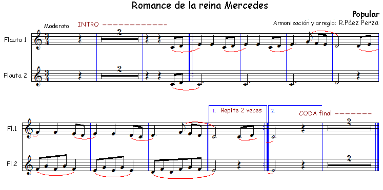
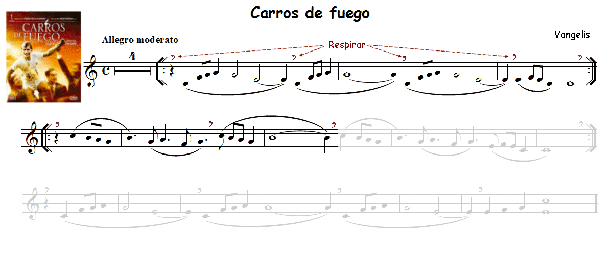
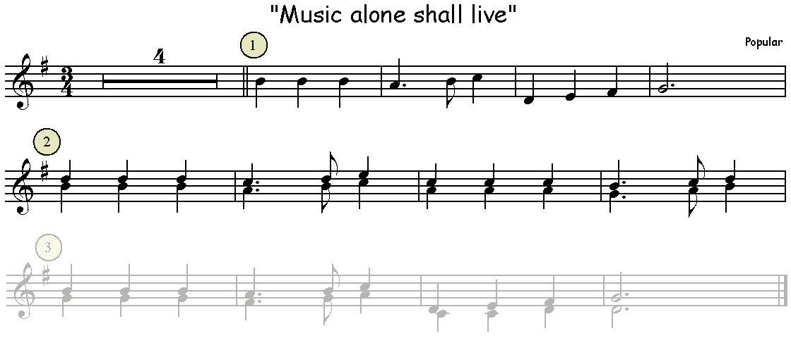
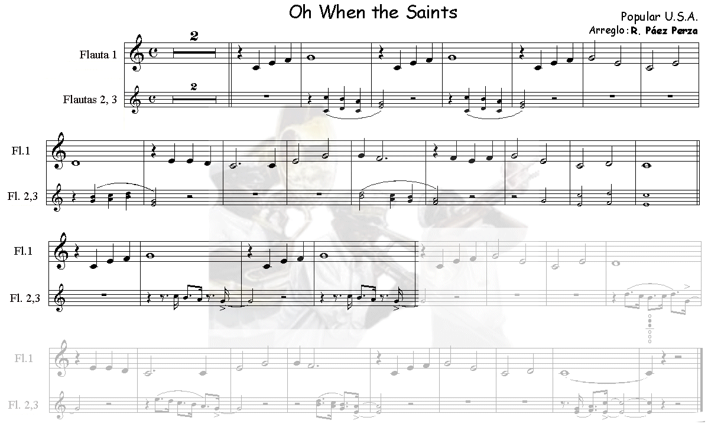
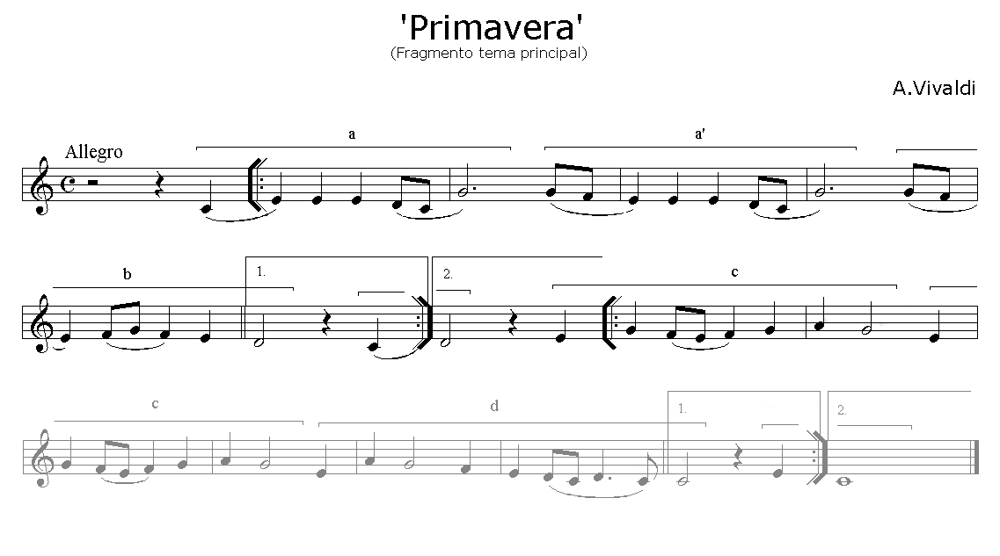
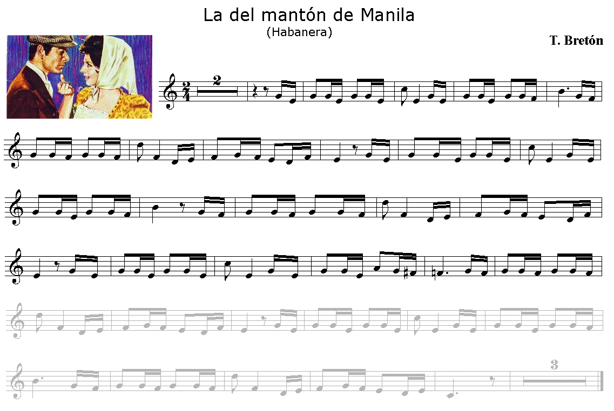
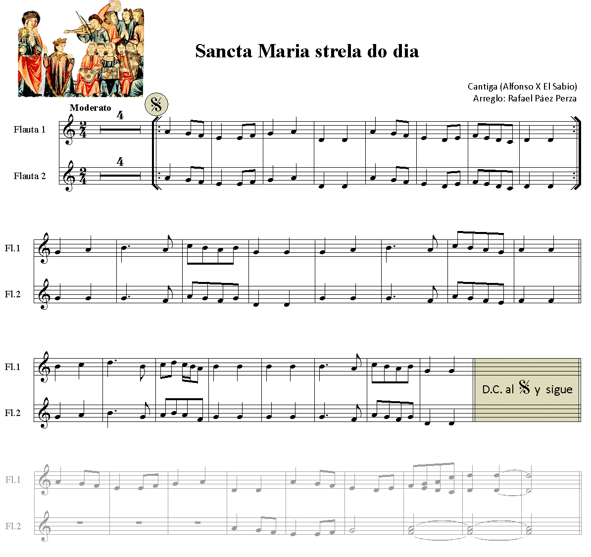

# Lección 15.- "Selección de temas y canciones escolares para flauta"

A estas alturas del curso, si todas las lecciones se han practicado correctamente, ya podemos disfrutar de temas melódicos extraídos de diferentes fuentes (folclore, cine, pop, etc.)

**Forma de realización**

- Estudiar primero sin audio.

- Una vez aprendido clicar sobre el audio y tocar con él adecuándose al 'tempo' establecido.

- Recordar las indicaciones que sobre el estudio instrumental se dieron en la "Introducción" del Módulo I.

**1. "Romance de la reina Mercedes"**

Arreglo, armonización y edición audio: R. Páez Perza

[L_15_RrMercedes.mp3](L_15_RrMercedes.mp3)</audio>

Clicar y tocar

Ø

**2. "Carros de fuego"**

****

Arreglo, armonización y edición audio: R. Páez Perza

[L15_Carros_Fragmento.mp3](L15_Carros_Fragmento.mp3)</audio>

Clicar y tocar

Ø

**3. "Music alone shall live"**

****

Arreglo, armonización y edición audio: R. Páez Perza

[L15_MusicAlone_Fragmento.mp3](L15_MusicAlone_Fragmento.mp3)</audio>

Clicar y tocar

Ø

**4. "Oh! When the Saints"**

****

Arreglo, armonización y edición audio: R. Páez Perza

[L15_WhenSaints_Fragmento.mp3](L15_WhenSaints_Fragmento.mp3)</audio>

Clicar y tocar

Ø

**5. "Primavera" (Vivaldi)**

****

Arreglo, armonización y edición audio: R. Páez Perza

[L15_Primavera_Fragmento.mp3](L15_Primavera_Fragmento.mp3)</audio>

Clicar y tocar

**6. "La del mantón de Manila" (T. Bretón)**

****

Arreglo y edición audio: R. Páez Perza 

[L15_Manton_Fragment.mp3](L15_Manton_Fragment.mp3)</audio>

Clicar y tocar

OBSERVACIONES

- Aunque aparentemente parece difícil de realizar con la flauta, en realidad no lo es.

- Si duplicamos los valores y cambiamos el compás a 4/4, la lectura de este tema resulta mucho más fácil.

Ø

**7. "Sancta Maria strela do dia" (Alfonso X El Sabio)**

****

Arreglo, armonización y edición audio: R. Páez Perza

[L15_StªMª_Fragment.mp3](L15_StaMa_Fragment.mp3)</audio>

Clicar y tocar

Ø

<iframe width="100%" height="400" style="display: block; margin-left: auto; margin-right: auto;" allowfullscreen="" frameborder="0" src="//www.youtube.com/embed/9w9EgEHEBiQ?rel=0"></iframe>

Ø

NOTA.- En ** ****[www.adarmus.com](http://www.adarmus.com/zMiscelanea.htm)**  encontrarás algunos de estos audios de acompañamiento completos.<strong style="color: #800000; font-size: medium;">**

 

