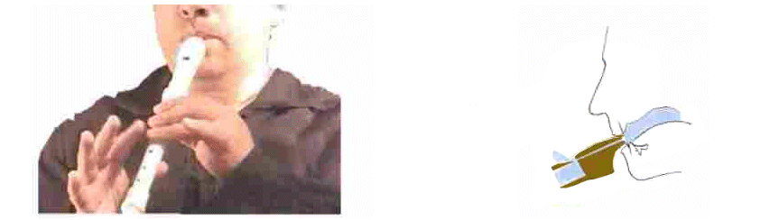
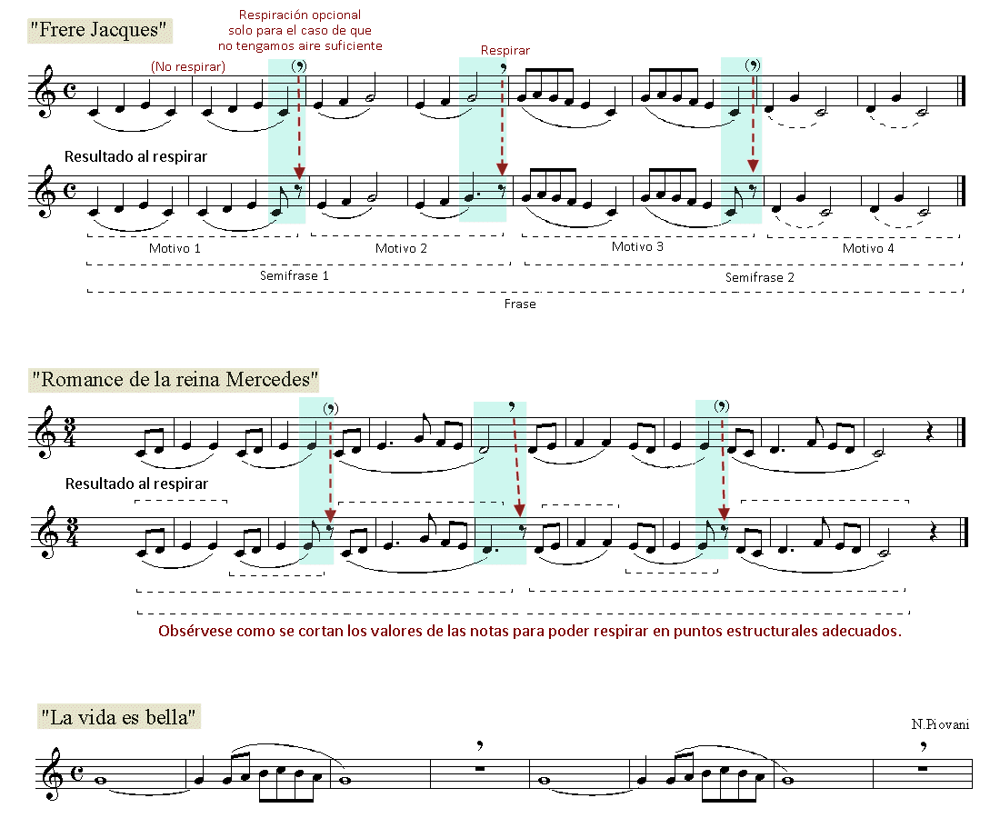

# Lección 1.- "La embocadura, la respiración y la colocación de las manos"

LA EMBOCADURA

Se denomina así a la forma y colocación de los labios sobre sobre la boquilla. La colocación de los labios sobre la boquilla debe ser natural, sin ningún tipo de tensión. Dado que se trata de un instrumento que no requiere esfuerzo alguno, precisamente lo contrario, los labios deben situarse alrededor de la boquilla de la manera más natural posible. La boquilla de la flauta debe introducirse en la boca más o menos un centímetro. 

COLOCACIÓN DEDOS Y MANOS

La mano izquierda arriba y la derecha abajo. La izquierda emplea el pulgar y los dedos índice, medio y anular. La derecha, en cambio no emplea el pulgar pero sí el dedo meñique.
Los dedos deben colocarse planos de manera que cada orificio se tape cómodamente con las yemas de los dedos. Si los dedos se curvan o están excesivamente rígidos lo más probable es que se escape el aire por algún orificio.
El pulgar de la mano derecha debe colocarse entre los orificios de los dedos índice y medio (debajo).
Cuando los dedos de la mano derecha no intervienen deben permanecer en expectativa cerca de sus respectivas posiciones para poder emplearlos cuando sea necesario. Hay que evitar que los dedos "se escondan" quedando fuera de su posición.

LA RESPIRACIÓN

La técnica respiratoria es muy importante en el aprendizaje de cualquier instrumento de viento. Es necesario saber como respirar y cuando hacerlo. Además, hay temas en los cuales los motivos, semifrases y frases se suceden sin interrupción alguna ¿Qué hacer entonces, dónde debemos respirar?

He aquí algunas consideraciones sobre la respiración:

1. Aprovechar siempre los silencios para respirar.
1. Respirar siempre por la boca, de una manera rápida y sin separar los labios de la embocadura o separarlos lo menos posible.
1. Enviar el aire a la parte baja de los pulmones sin elevar la caja torácica ni los hombros con el fin de evitar la respiración torácica y favorecer la diafragmática que es la que conviene a los instrumentistas de viento.
1. Tener siempre en cuenta las divisiones estructurales de la melodía al respirar. No hacerlo nunca en medio de un motivo, semifrase o frase. 
1. Cuando no aparecen silencios y la melodía fluye de manera continua hay que aprovechar los reposos cadenciales que coinciden casi siempre con la semifrases (4 compases). Si no se llega, también es posible respirar entre motivos (2 compases). La forma de hacerlo es reduciendo el valor de alguna nota larga en relación al contexto y aprovechar el hueco así creado para respirar.

Veamos cómo se realiza:

La mejor manera de estudiar la técnica respiratoria es observar a los grandes intérpretes o instrumentistas de viento, independientemente del instrumento que toquen.

  

### Observa como respiran los intérpretes

https://www.youtube.com/watch?v=0XiHU8To1d0&feature=youtu.be

Giovanni Antonini (Concierto para flautín en Do mayor de Vivaldi)

https://www.youtube.com/watch?v=CZhMAUJuYZc&feature=youtu.be

Flautas de pico poco frecuentes en estilo clásico y contemporáneo (ver estilo contemporáneo del 13'25'' a 22'02''). El Cuarteto emplea más de 30 flautas de pico diferentes.
El 14 de mayo de 2011 el programa nocturno de la Noche de los Museos en el Centro de Artes Cafesjian presentó un concierto del 'Quartet New Generation' (alemán) organizado en colaboración con el Instituto Goethe y la Embajada de Alemania en Armenia. 

