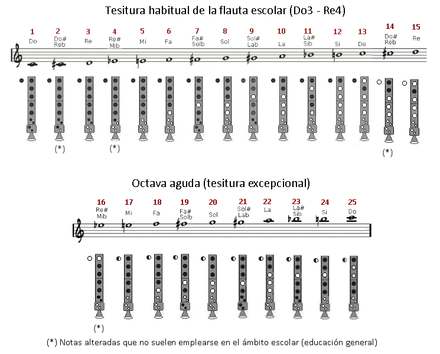

# Lección 2.- "La emisión, prolongación y final del sonido (notas largas). Primeras notas: Sol, La, Si"

En esta lección aprenderemos a emitir (comenzar) un sonido, prolongarlo y finalizarlo correctamente. Emplearemos para ello las notas Sol, La y Si (sonidos 8, 10 y 12 de la tabla que aparece en el párrafo siguiente). Antes de comenzar este tema veamos la tabla de posiciones de la flauta escolar moderna (no confundir con la alemana - ver lección anterior) que emplearemos en este curso inicial:

En la mayoría de melodías escolares solo utilizaremos las notas de la escala de Do mayor (sin notas alteradas) que van desde Do3 al Re4: notas 1-3-5-6-8-10-12-13-15. De las notas alteradas solo el Sib, el Fa# y el Sol# se emplean alguna vez.

LA EMISIÓN, PROLONGACIÓN Y FINAL DEL SONIDO

Para **emitir un sonido** en un instrumento de viento es necesario el empleo de la lengua como válvula que da paso al aire. Antes de emitir un sonido, Sol por ejemplo, hay que tomar aire y taponar con la lengua su paso. La flauta no emitirá ningún sonido. A continuación retiramos la lengua y el aire retenido se introducirá en el tubo y producirá el sonido de una forma controlada y precisa - en muchos métodos para instrumentos de viento se dice que es muy parecido a "pronunciar" la sílaba TU. Seguidamente hay que controlar la calidad del sonido prolongado de manera que no fluctúe, que permanezca "quieto", sin cambios de altura ni de intensidad, homogéneo. Finalmente terminaremos el sonido de manera inversa a como lo comenzamos, o sea, taponando nuevamente con la lengua el paso del aire.

Como norma orientativa el sonido producido debe ser "musical": sin estridencias, sin agresividad, etc. La simple escucha atenta del sonido que producimos nos dará la pista sobre si lo estamos haciendo bien o no. La flauta escolar, dulce o de pico es un instrumento que necesita muy poco aire y requiere muy poco esfuerzo para hacerlo sonar. Este es quizás su mayor inconveniente, pues los alumnos-as suelen enviar el aire con demasiada o con poca presión lo que produce sonidos de escasa calidad y desafinados. Tendremos que buscar y encontrar este punto intermedio en el flujo de aire hasta conseguir el sonido ideal.

Por todo ello esta es, sin duda, la lección más importante. De ella dependerá que aprendamos a tocar con flauta de manera correcta y con control a la hora de comenzar (emitir), prolongar y finalizar el sonido.

EJERCICIOS

Realizar las notas Sol, La y Si de los ejercicios siguientes de la manera indicada como correcta, prestando atención a la emisión, mantenimiento (prolongación) y final del sonido. Cada nota dura siete tiempos o pulsos (redonda ligada a blanca con puntillo) que deberás respetar siguiendo el "tempo" marcado por el audio de acompañamiento. Repite el ejercicio tantas veces como sea necesario hasta que lo realices correctamente. Estudiar primero sin audio y una vez dominados incluir el audio.

Emisión, prolongación y final de las notas Sol - La - Si

<iframe width="100%" height="166" scrolling="no" frameborder="no" src="https://w.soundcloud.com/player/?url=https%3A//api.soundcloud.com/tracks/344090286&amp;color=%23ff5500&amp;auto_play=false&amp;hide_related=false&amp;show_comments=true&amp;show_user=true&amp;show_reposts=false"></iframe>
<iframe width="100%" height="166" scrolling="no" frameborder="no" src="https://w.soundcloud.com/player/?url=https%3A//api.soundcloud.com/tracks/344090282&amp;color=%23ff5500&amp;auto_play=false&amp;hide_related=false&amp;show_comments=true&amp;show_user=true&amp;show_reposts=false"></iframe>
<iframe width="100%" height="166" scrolling="no" frameborder="no" src="https://w.soundcloud.com/player/?url=https%3A//api.soundcloud.com/tracks/344090284&amp;color=%23ff5500&amp;auto_play=false&amp;hide_related=false&amp;show_comments=true&amp;show_user=true&amp;show_reposts=false"></iframe>

La práctica de notas largas debe ser un trabajo habitual en el estudio de la flauta. Aunque parezca una práctica simple, forma parte del trabajo diario de los instrumentistas profesionales para conseguir **calidad sonora**. Evidentemente introducen algunas variables: diferentes intensidades, "crescendo y diminuendo", vibrato, diferentes tipos de ataque al emitir la nota, etc.

## ACTIVIDAD DE AMPLIACIÓN (opcional)

Practicar con notas largas sobre otras notas prestando atención al ataque o emisión (TU), a la prolongación del sonido y a su final. Es conveniente alargar la nota todo lo que se pueda, pero sin llegar a agotar completamente el aire disponible.
