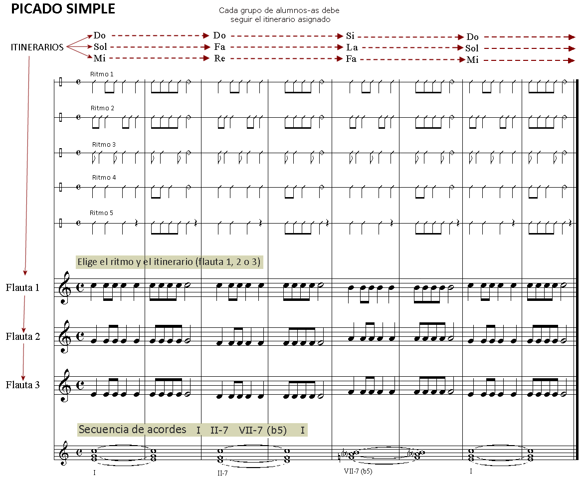

# Lección 3.- "Articulaciones básicas: ligado y picado simple"

Existen varios tipos de articulación del sonido en los instrumentos de viento. En este curso solo estudiaremos los dos más básicos y que considero imprescindibles para un aprendizaje básico correcto: ligado ("legato") y picado o picado simple.

El "**legato**" o **ligado** consiste en interpretar dos o más notas seguidas con el mismo soplo o columna de aire, o sea, sin que haya interrupciones entre ellas. Las notas ligadas aparecen en partitura sobre o bajo una línea curva (ligadura de expresión). En toda ligadura hay que tener en cuenta tres factores:

1. El soplo o columna de aire que viene determinado por la suma de los valores de las notas ligadas. Debe iniciarse con la emisión del sonido a través del movimiento o 'golpe' de lengua (TU).

2. El ritmo (valores de las figuras).

3. La altura (notas). 

<iframe width="100%" height="166" scrolling="no" frameborder="no" src="https://w.soundcloud.com/player/?url=https%3A//api.soundcloud.com/tracks/344090298&amp;color=%23ff5500&amp;auto_play=false&amp;hide_related=false&amp;show_comments=true&amp;show_user=true&amp;show_reposts=false"></iframe>

COMENTARIO.- La primera ligadura deberá iniciarse con la sílaba 'TU' (golpe de lengua para emitir) y prolongar el soplo o columna de aire durante ocho tiempos o pulsos (4 negras + 2 blancas) de manera ininterrumpida mientras los dedos evolucionan según el ritmo y altura de las notas. Lo segunda y tercera ligaduras funcionarán de la misma manera.

El **picado** se interpreta articulando o emitiendo cada una de las notas con la sílaba TU. Las notas deben "picarse" siempre que no aparezcan ligadas. Una vez picadas o articuladas hay que darles el valor rítmico que cada una tiene (blanca, negra, etc.).

<iframe width="100%" height="166" scrolling="no" frameborder="no" src="https://w.soundcloud.com/player/?url=https%3A//api.soundcloud.com/tracks/344090302&amp;color=%23ff5500&amp;auto_play=false&amp;hide_related=false&amp;show_comments=true&amp;show_user=true&amp;show_reposts=false"></iframe>

EJERCICIOS

Realiza los ejercicios siguientes empleando el ligado opcional (ligaduras discontinuas) y/o el picado simple. Para ello emplearemos las tres notas que ya conocemos: Sol - La - Si

Armonización y edición audio: R.Páez Perza

<iframe width="100%" height="166" scrolling="no" frameborder="no" src="https://w.soundcloud.com/player/?url=https%3A//api.soundcloud.com/tracks/344090291&amp;color=%23ff5500&amp;auto_play=false&amp;hide_related=false&amp;show_comments=true&amp;show_user=true&amp;show_reposts=false"></iframe>

Audio ejercicios 1, 2 y 3 -&gt; CLICAR Y TOCAR

<iframe width="100%" height="166" scrolling="no" frameborder="no" src="https://w.soundcloud.com/player/?url=https%3A//api.soundcloud.com/tracks/344090293&amp;color=%23ff5500&amp;auto_play=false&amp;hide_related=false&amp;show_comments=true&amp;show_user=true&amp;show_reposts=false"></iframe>
Metrónomo opcional para los ejercicios 4 al 12 (80 p/m)

 

## ACTIVIDADES DE AMPLIACIÓN (opcionales)

**Nota.- **Dado que estos ejercicios y actividades emplean notas que todavía no se han practicado, parece conveniente realizarlos después de haber completado la lección 6. No obstante, sí pueden practicarse los ejercicios que empleen las notas Sol, La, Si.

**Actividades de ampliación 1**

<iframe width="100%" height="166" scrolling="no" frameborder="no" src="https://w.soundcloud.com/player/?url=https%3A//api.soundcloud.com/tracks/344092892&amp;color=%23ff5500&amp;auto_play=false&amp;hide_related=false&amp;show_comments=true&amp;show_user=true&amp;show_reposts=false"></iframe>

Clicar y tocar

Objetivos:

- Practicar el picado simple. Realizar monódicamente: primero el pentagrama inferior, luego el central y finalmente el superior.
- Realizar polifónicamente de manera simultánea, agrupando los alumnos-as de tres en tres (trío) o bien dividiendo el grupo clase en tres subgrupos.
- Coordinarse con el audio (tempo).

**Actividades de ampliación 2**

****

FORMA DE REALIZACIÓN

1. Dividir la clase en tres grupos de alumnos de manera que:

1. A la voz o parte inferior (flauta 3) le corresponda el 50% de los alumnos-as.
1. A parte intermedia (flauta 2) el 30 - 35% de alumnos-as
1. A la parte superior (flauta 1) el 15 - 20% de los alumnos-as

       De esta manera compensaremos el aumento natural de intensidad conforme ascendemos hacia el registro agudo.

2. Aplicar uno de los diseños rítmicos (hay 5, pero pueden crearse otros) a todas las partes (flauta 1, 2 y 3).

3. He aquí otras opciones armónicas sobre las que aplicar los diferentes diseños rítmicos:

OBJETIVOS

- Practicar el picado simple.
- Experimentar la realización polifónica (secuencias de acordes -conclusivas y/o suspensivas-) en grupo.
- Acostumbrarse a seguir el pulso en actividades grupales.

Ø

**Actividades de ampliación 3**

## Audición

Escucha atentamente el audio del siguiente vídeo y trata de reconocer los dos tipos de articulación que hemos aprendido en esta lección.

<iframe width="100%" height="384" style="display: block; margin-left: auto; margin-right: auto;" allowfullscreen="" frameborder="0" src="http://www.youtube.com/embed/fkzxxoGqrh8?rel=0&amp;wmode=transparent"></iframe>

Concerto Fa mayor (Allegro) de G. Sammartini interpretado por Lenka Molcanyiova

