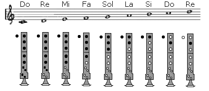
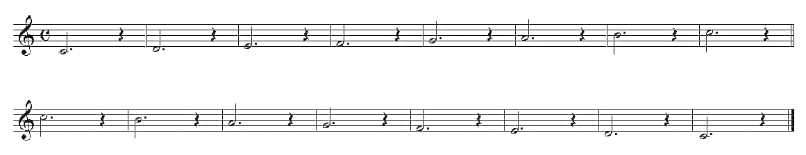
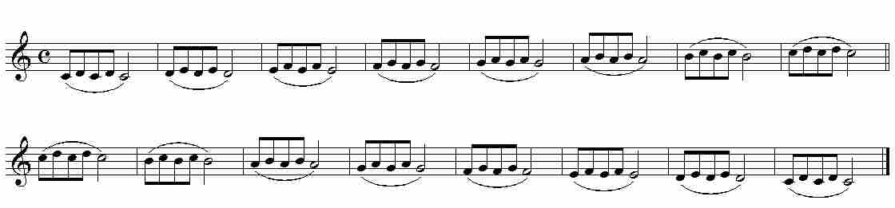
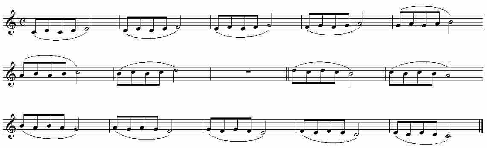
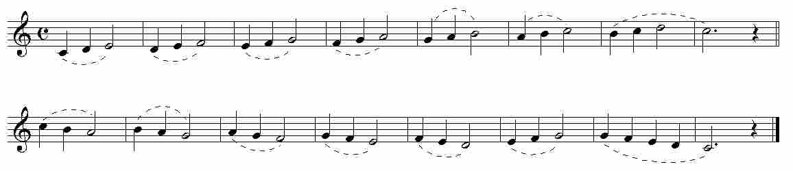
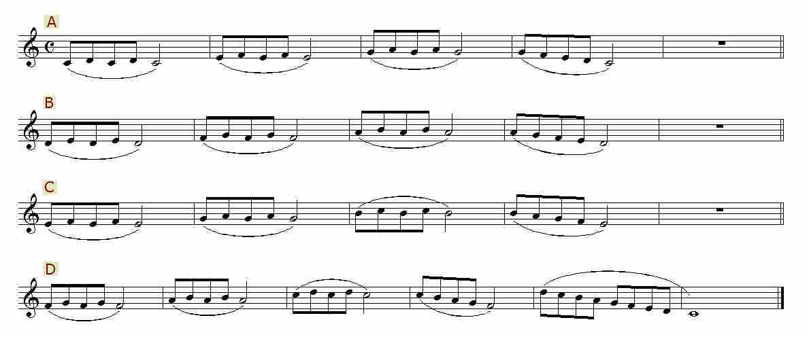
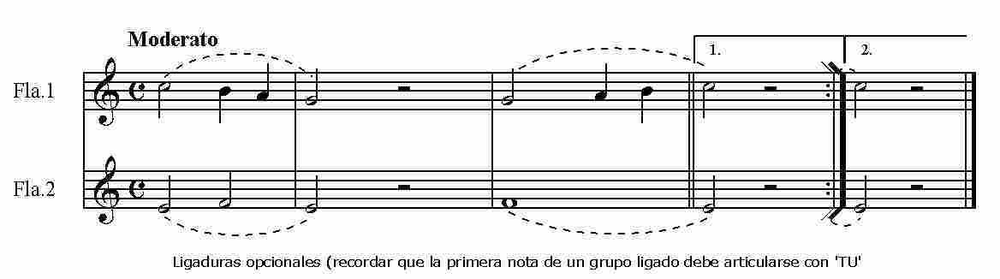
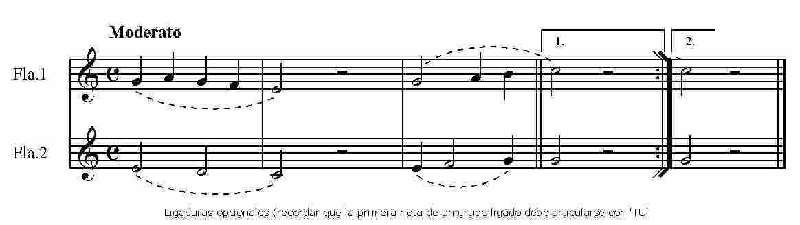
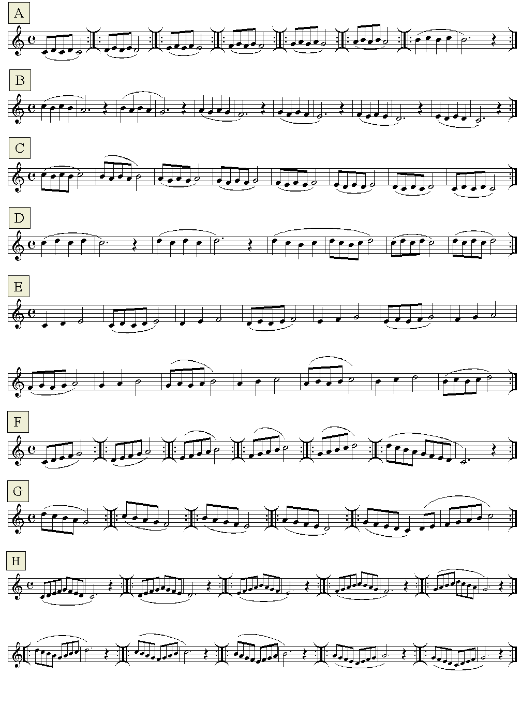

# Lección 4.- "Movimientos melódicos por grados conjuntos: 2as (Do3 a Re4)"

Evolucionar melódicamente por grados conjuntos significa ir desde una nota a la contigua o más cercana, tanto ascendente como descendentemente. Por ejemplo Do-Re / Re-Mi / Mi-Fa / ... (o viceversa) son grados conjuntos o contiguos. Do-Re-Mi-Fa-Sol también. Do-Mi-La no son grados conjuntos.

En este tipo de movimiento melódico y dentro del ámbito más habitual de la flauta escolar (Do3 -&gt; Re4) sólo hay que mover un dedo para cambiar de nota. 

Mencionar, por último, algunos pasos de especial dificultad dentro del ámbito melódico Do3 -&gt; Re4 como son todos aquellos pasajes en los que interviene el Do3 (nota más grave de la flauta) y las notas Si3, Do4 y Re4. El Do3 conviene practicarlo de una manera aislada hasta conseguir emitirlo de manera segura. Las notas Si3, Do4 y Re4 son algo más difíciles de realizar por varias razones:

a) Son notas cercanas al registro agudo y que, por tanto, hay que controlar (calidad  sonora, exceso de intensidad, afinación).

b) La relación entre Si3-Do4 y Do4-Re4 ofrece algunas dificultades de digitación que se comprobarán al realizar los ejercicios.

Estos pasajes de especial dificultad se verán en las lecciones 6 y 7.

EJERCICIOS

**Forma de realización**

- Estudiar primero sin audio.

- Una vez aprendido clicar sobre el audio y tocar con él adecuándose al 'tempo' establecido.

- Recordar las indicaciones que sobre el estudio instrumental se dieron en la "Introducción" del Módulo I.

**Ejercicio 1**

Armonización y edición audio: R.Páez Perza

<iframe width="100%" height="166" scrolling="no" frameborder="no" src="https://w.soundcloud.com/player/?url=https%3A//api.soundcloud.com/tracks/344090288&amp;color=%23ff5500&amp;auto_play=false&amp;hide_related=false&amp;show_comments=true&amp;show_user=true&amp;show_reposts=false"></iframe>

Acompañamiento ejercicio 1 -&gt; CLICAR Y TOCAR

**Ejercicio 2**

Armonización y edición audio: R.Páez Perza

<iframe width="100%" height="166" scrolling="no" frameborder="no" src="https://w.soundcloud.com/player/?url=https%3A//api.soundcloud.com/tracks/344090288&amp;color=%23ff5500&amp;auto_play=false&amp;hide_related=false&amp;show_comments=true&amp;show_user=true&amp;show_reposts=false"></iframe>

Acompañamiento ejercicio 2 -&gt; CLICAR Y TOCAR (el audio es el mismo que el del ejercicio 1)

**Ejercicio 3**

Armonización y edición audio: R.Páez Perza

<iframe width="100%" height="166" scrolling="no" frameborder="no" src="https://w.soundcloud.com/player/?url=https%3A//api.soundcloud.com/tracks/344090295&amp;color=%23ff5500&amp;auto_play=false&amp;hide_related=false&amp;show_comments=true&amp;show_user=true&amp;show_reposts=false"></iframe>

CLICAR Y TOCAR

**Ejercicio 4** 

Armonización y edición audio: R.Páez Perza

<iframe width="100%" height="166" scrolling="no" frameborder="no" src="https://w.soundcloud.com/player/?url=https%3A//api.soundcloud.com/tracks/344090235&amp;color=%23ff5500&amp;auto_play=false&amp;hide_related=false&amp;show_comments=true&amp;show_user=true&amp;show_reposts=false"></iframe>

CLICAR Y TOCAR

**Ejercicio 5**

Armonización y edición audio: R.Páez Perza

<iframe width="100%" height="166" scrolling="no" frameborder="no" src="https://w.soundcloud.com/player/?url=https%3A//api.soundcloud.com/tracks/344090294&amp;color=%23ff5500&amp;auto_play=false&amp;hide_related=false&amp;show_comments=true&amp;show_user=true&amp;show_reposts=false"></iframe>

CLICAR Y TOCAR

**Ejercicio 6**

Armonización y edición audio: R.Páez Perza

<iframe width="100%" height="166" scrolling="no" frameborder="no" src="https://w.soundcloud.com/player/?url=https%3A//api.soundcloud.com/tracks/344090289&amp;color=%23ff5500&amp;auto_play=false&amp;hide_related=false&amp;show_comments=true&amp;show_user=true&amp;show_reposts=false"></iframe>

CLICAR Y TOCAR

**Ejercicio 7**

Armonización y edición audio: R.Páez Perza

<iframe width="100%" height="166" scrolling="no" frameborder="no" src="https://w.soundcloud.com/player/?url=https%3A//api.soundcloud.com/tracks/344090296&amp;color=%23ff5500&amp;auto_play=false&amp;hide_related=false&amp;show_comments=true&amp;show_user=true&amp;show_reposts=false"></iframe>

CLICAR Y TOCAR

## ACTIVIDADES DE AMPLIACIÓN (opcionales)

**Actividad 1**

En la Lección 15 encontrarás una canción del folclore popular cuya melodía puede considerarse que evoluciona por grados conjuntos con la excepción de algún mínimo salto de 3ª. Se trata del "Romance de la reina Mercedes" (melodía principal).

**Actividad 2**

Realiza-estudia-practica con los siguientes ejercicios. 

