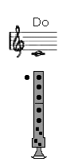

# Lección 5.- "El Do3 o nota más grave de la flauta"

La nota Do3 o nota más grave de la flauta escolar ofrece ciertas dificultades que hay que superar para que podamos emplearla con comodidad en las actividades que se propongan. Las dificultades que presenta son las siguientes.

1. Es la nota más débil de la flauta, la de menos intensidad. Para emitirla y prolongarla con seguridad requiere un flujo de aire mucho más reducido que el resto notas. Si no enviamos la cantidad precisa de aire, que no debe ser mucho, o bien no sonará, sonará mal o saltará al Do4. 
1. Al moverse hacia otras notas, especialmente por grados disjuntos (intervalos superiores al de 2ª), acciona los dedos anular y meñique de manera simultánea, dedos considerados como los "más torpes" de movimiento. 

EJERCICIOS   Recordar las indicaciones que sobre el estudio instrumental se dieron en la "Introducción" del Módulo I.

Audio para los ejercicios 1 a 4 (en preparación)

Audio para los ejercicios 5 a 7 (en preparación)

Audio para los ejercicios 8 a 10 (en preparación)

Audio para los ejercicios 11 a 13 (en preparación)

Audio para los ejercicios 14 a 16 (en preparación)

## ACTIVIDADES DE AMPLIACIÓN (opcionales)

Practicar notas largas con Do3 (mantener el sonido 8-10 segundos). Si no sale correctamente, volver a realizar los ejercicios 1 a 4. Es importante recordar que es la nota más débil de la flauta, la que requiere menor flujo y presión de aire.
