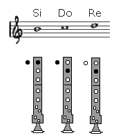
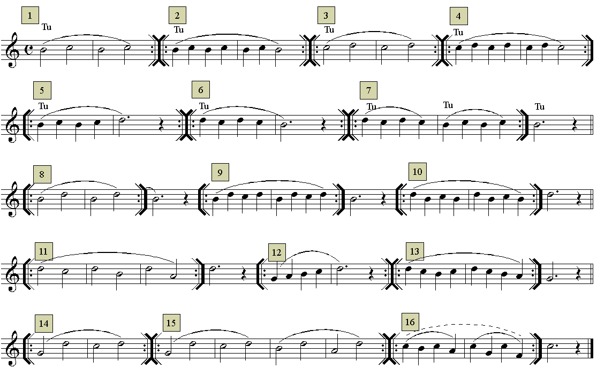
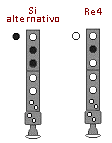

# Lección 6.- "Pasajes con las notas Si3, Do4 y Re4"

La relación entre Si3-Do4 y Do4-Re4, o bien las tres notas juntas en cualquier combinación melódica, ofrece ciertas dificultades técnicas de realización que deben ser practicadas y superadas. Estas dificultades hacen referencia a determinados movimientos de los dedos índice y medio, así como al movimiento inusual del pulgar de la mano izquierda.

EJERCICIOS

- La primera nota de un grupo ligado debe articularse (golpe de lengua que permite el paso del aire -&gt; TU). El resto de notas ligadas no, por lo tanto habrá que seguir enviando aire y moviendo los dedos a la posición de la nota que corresponda. La última nota de las ligadas debe acabar interrumpiendo con la lengua el paso del aire. Este procedimiento que en principio parece complejo, con la práctica se hace automático y resulta imprescindible para el control de los sonidos largos y de los grupos de notas ligadas.

- Las indicaciones que sobre el estudio instrumental se dieron en la "Introducción" del Módulo I.

POSICIÓN ALTERNATIVA DEL Si3
- Existe una posición alternativa para el Si3 que conviene emplear cuando este se dirige al Re4 y viceversa. Esta posición alternativa facilita mucho la realización de estos pasajes.  
- También conviene emplearla cuando se realiza la bordadura o floreo inferior del Do4 (Do-Si-Do).

## ACTIVIDADES DE AMPLIACIÓN (opcionales)
PRÁCTICA DEL Si3 ALTERNATIVO   Observa los ejercicios 8, 9, 10, 11 y 15 y comprobarás que contienen el paso Si3 a Re4 o viceversa. Realiza-estudia estos ejercicios empleando la posición alternativa para el Si3 teniendo en cuenta lo siguiente:

- Realiza los ejercicios que aparecen a continuación (1 a 4) empleando la posición del Si3 alternativo. Recuerda que cuando la melodía contiene en su diseño el salto del Si3 al Re4 o viceversa, hay que emplear la posición del "Si alternativo". Ello permite facilitar la realización del pasaje, el cual resultaría mucho más difícil empleando su posición habitual.

- La posición del Si3 alternativo también puede ser útil en los movimientos melódicos por grados conjuntos. Concretamente cuando la melodía realiza una bordadura o floreo inferior del Do4 (Do-Si-Do). También es posible su empleo en movimientos conjuntos en los que se emplea la posición normal (Re-Do-Si-La-Sol o viceversa). En este último caso es el instrumentista quien debe valorar que camino seguir.

Audio de acompañamiento ejercicio 1
 

Audio de acompañamiento ejercicio 2
 

Audio de acompañamiento ejercicio 3
 

Audio de acompañamiento ejercicio 4 (en preparación)  Armonización y edición audios: R. Páez Perza

