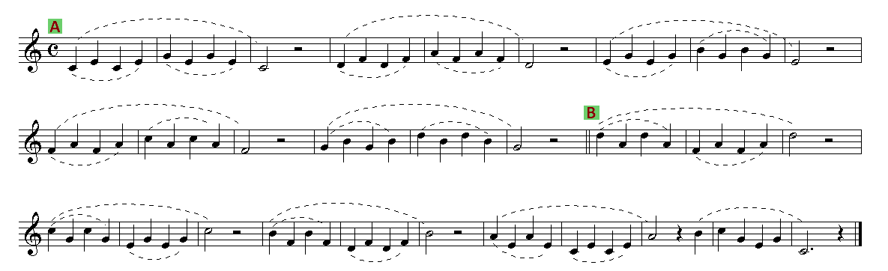
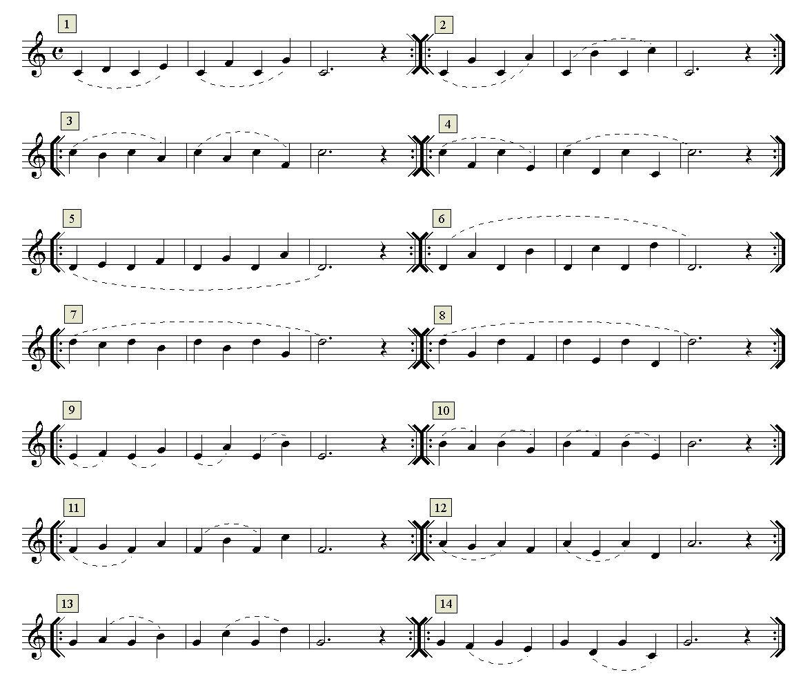
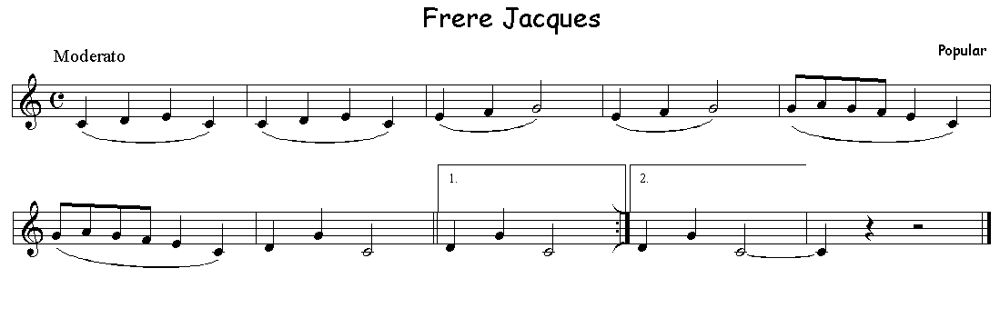
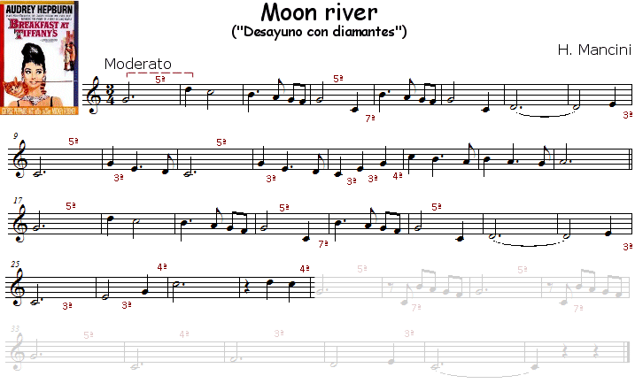

# Lección 7.- "Movimientos melódicos disjuntos: 3as, 4as, 5as, etc. (Do3 a Re4)"

Se entiende por movimiento disjunto al movimiento melódico superior al de 2ª, o sea, los de 3ª, 4ª, 5ª, etc. En este curso no iremos más allá de los dos primeros, es decir, los de 3ª y 4ª. Excepcionalmente es posible que aparezcan saltos de 5ª o 6ª, pero son muy raros en los temas escolares.

EJERCICIOS

**Forma de realización con audio de acompañamiento** 

 - Estudiar primero sin audio.

 - Una vez aprendido clicar sobre el audio y tocar con él adecuándose al 'tempo' establecido.

 - Recordar las indicaciones que sobre el estudio instrumental se dieron en la "Introducción" del Módulo I.

Armonización y edición audio: R. Páez Perza

<iframe width="100%" height="166" scrolling="no" frameborder="no" src="https://w.soundcloud.com/player/?url=https%3A//api.soundcloud.com/tracks/344090259&amp;color=%23ff5500&amp;auto_play=false&amp;hide_related=false&amp;show_comments=true&amp;show_user=true&amp;show_reposts=false"></iframe>

CLICAR Y TOCAR

**Forma de realización sin audio de acompañamiento**
 - Estudiar cada ejercicio comenzando lentamente e ir ganando velocidad (tempo) poco a poco. La velocidad máxima no debe superar las 100 pulsaciones por minuto.
 - Aplicar diferentes articulaciones:
  - Todo ligado
  - Todo picado (notas sueltas)
  - Aplicar las ligaduras discontinuas
  
  Puede ser conveniente la utilización de un metrónomo para asegurar el tempo.

## ACTIVIDADES DE AMPLIACIÓN (opcionales)

1. Estudia y realiza el siguiente tema popular con su correspondiente audio de acompañamiento.

Arreglo y edición audio e imagen: R.Páez Perza

<iframe width="100%" height="166" scrolling="no" frameborder="no" src="https://w.soundcloud.com/player/?url=https%3A//api.soundcloud.com/tracks/344090303&amp;color=%23ff5500&amp;auto_play=false&amp;hide_related=false&amp;show_comments=true&amp;show_user=true&amp;show_reposts=false"></iframe>

2. Estudia y realiza el siguiente tema de la película "Desayuno con diamantes". Tema que contiene frecuentes saltos melódicos.

.
Arreglo y edición audio: R.Páez Perza
<iframe width="100%" height="166" scrolling="no" frameborder="no" src="https://w.soundcloud.com/player/?url=https%3A//api.soundcloud.com/tracks/344090265&amp;color=%23ff5500&amp;auto_play=false&amp;hide_related=false&amp;show_comments=true&amp;show_user=true&amp;show_reposts=false"></iframe>

