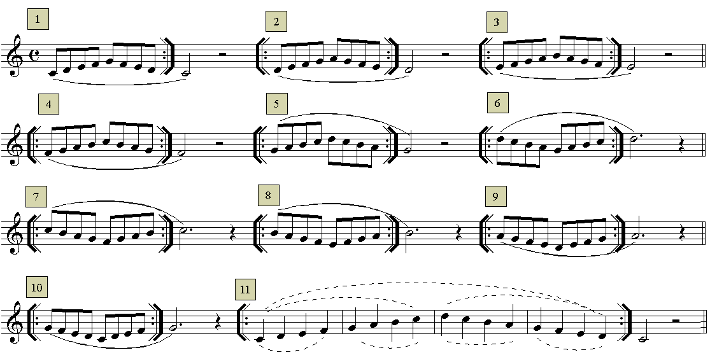

# Lección 8.- "Fragmentos de escalas y escala de Do M (Do3 a Re4)"

Debido al ámbito melódico tan reducido que hemos visto hasta ahora (Do3-Re4), las escalas y arpegios se estudiarán de manera fragmentada. Ver arpegios en la lección 12.
El estudio de escalas y arpegios forma parte de la técnica básica de todos los instrumentos musicales.

### Escalas (fragmentos)

## ACTIVIDADES DE AMPLIACIÓN (opcionales)

Modifica las articulaciones de los ejercicios anteriores. Por ejemplo:

  - Todas las notas sueltas ('picadas')

  - Ligadas de 4 en 4 y/o de 2 en 2

  - Cuatro ligadas y cuatro picadas

  - Etc.
