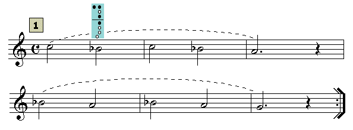

# Lección 9.- "Notas alteradas: Sib"

### EJERCICIOS

**Forma de realización**

- Estudiar primero sin audio.

- Una vez aprendido clicar sobre el audio y tocar con él adecuándose al 'tempo' establecido.

- Recordar las indicaciones que sobre el estudio instrumental se dieron en la "Introducción" del Módulo I.

<iframe width="100%" height="166" scrolling="no" frameborder="no" src="https://w.soundcloud.com/player/?url=https%3A//api.soundcloud.com/tracks/344090246&amp;color=%23ff5500&amp;auto_play=false&amp;hide_related=false&amp;show_comments=true&amp;show_user=true&amp;show_reposts=false"></iframe>

Audio de acompañamiento del ejercicio 1 (clicar y tocar)

<iframe width="100%" height="166" scrolling="no" frameborder="no" src="https://w.soundcloud.com/player/?url=https%3A//api.soundcloud.com/tracks/344090248&amp;color=%23ff5500&amp;auto_play=false&amp;hide_related=false&amp;show_comments=true&amp;show_user=true&amp;show_reposts=false"></iframe>

Audio de acompañamiento del ejercicio 2 (clicar y tocar)

<iframe width="100%" height="166" scrolling="no" frameborder="no" src="https://w.soundcloud.com/player/?url=https%3A//api.soundcloud.com/tracks/344090249&amp;color=%23ff5500&amp;auto_play=false&amp;hide_related=false&amp;show_comments=true&amp;show_user=true&amp;show_reposts=false"></iframe>

Audio de acompañamiento del ejercicio 3 (clicar y tocar)

## Realiza

Aquí tienes el tema central de la película "Titanic" del compositor H. Horner: "My heart will go on" en un arreglo para flauta escolar con acompañamiento. Debes empezar a tocar en la casilla de 2ª de la primera repetición (compás 11).

Arreglo y edición audio: R.Páez Perza
<iframe width="100%" height="166" scrolling="no" frameborder="no" src="https://w.soundcloud.com/player/?url=https%3A//api.soundcloud.com/tracks/344090304&amp;color=%23ff5500&amp;auto_play=false&amp;hide_related=false&amp;show_comments=true&amp;show_user=true&amp;show_reposts=false"></iframe>
CLICAR Y TOCAR (¡Ojo! Comienza en compás 11, casilla de 2ª)

## ACTIVIDADES DE AMPLIACIÓN (opcionales)

**Actividad de ampliación 1**

Realizar solo los que incluyen el Sib

**Actividad de ampliación 2**

**Actividad de ampliación 3**

Realizar los ejercicios del Tema 6 cambiando todos los Si (naturales) por Sib.

**Actividad de ampliación 4**

Realiza nuevamente los ejercicios de la Lección 8 que contengan la nota Si y sustitúyelas por Sib. 

** **
